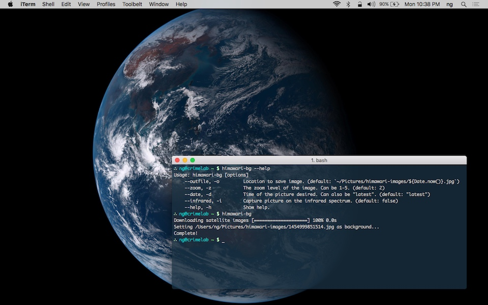

# himawari-bg

> Set the latest image from Himawari 8 as your desktop background

[![npm][npm-image]][npm-url]
[![travis][travis-image]][travis-url]
[![standard][standard-image]][standard-url]

[npm-image]: https://img.shields.io/npm/v/himawari-bg.svg?style=flat-square
[npm-url]: https://www.npmjs.com/package/himawari-bg
[travis-image]: https://img.shields.io/travis/ngoldman/himawari-bg.svg?style=flat-square
[travis-url]: https://travis-ci.org/ngoldman/himawari-bg
[standard-image]: https://img.shields.io/badge/code%20style-standard-brightgreen.svg?style=flat-square
[standard-url]: http://npm.im/standard



Note: This is alpha quality! Tested only on OSX.

:point_right: You have to set the background color of your desktop to black manually.

## Install

Warning: requires :zap: **magick** :zap:

```
brew install imagemagick
brew install graphicsmagick
npm install himawari-bg
```

## Usage

```js
var bg = require('himawari-bg')

bg({
  /**
   * The location to save the resulting image.
   * Default: `~/Pictures/himawari-images/${Date.now()}.jpg`
   * @type {String}
   */
  outfile: '/path/to/output/earth.jpg',

  /**
   * The time of the picture desired. If you want to get the latest image, use 'latest'.
   * Default: 'latest'
   * @type {String|Date}
   */
  date: 'latest', // Or new Date() or a date string

  /**
   * The zoom level of the image. Can be 1-5 (default: 1)
   * Each zoom level requires more images to be downloaded and therefore stitched
   * together. Higher zoom yields a higher resolution image.
   * Default: 2
   * @type {Number}
   */
  zoom: 2,

  /**
   * If set to true, an image on the infrared light spectrum will be generated
   * Default: false
   * @type {Boolean}
   */
  infrared: false
})
```

### Command Line Interface

There is also a command-line interface available if you install with the `-g` option.

```
npm i -g himawari-bg
```

This installs a program called himawari-bg that can be used like so:

```
Usage: himawari-bg [options]
    --outfile, -o         The location to save the resulting image. (default: `~/Pictures/himawari-images/${Date.now()}.jpg`)
    --zoom, -z            The zoom level of the image. Can be 1-5. (default: 2)
    --date, -d            The time of the picture desired. If you want to get the latest image, use "latest". (default: "latest")
    --infrared, -i        Capture picture on the infrared spectrum. (default: false)
    --help, -h            Show help.
```

### Acknowledgement

Thanks to [celoyd](https://github.com/celoyd) for the inspiring [glittering.blue](https://glittering.blue/) and [jakiestfu](https://github.com/jakiestfu) for creating [himawari.js](https://github.com/jakiestfu/himawari.js).

## License

[ISC](LICENSE)
